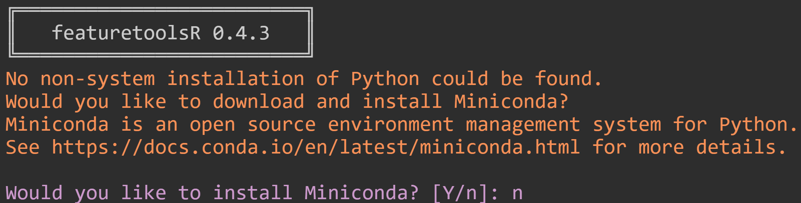

# featuretoolsRパッケージについて

[featuretoolsR](https://github.com/magnusfurugard/featuretoolsR)パッケージは、Pythonで自動的に (機械学習のための) 特徴量生成を行う[featuretools](https://www.featuretools.com/)ライブラリをRから呼び出すためのインターフェースです。

# パッケージのインストール

featuretoolsRパッケージは[CRAN](https://cran.r-project.org/web/packages/featuretoolsR/index.html)にも登録されているので、`install.packages()` 関数などで簡単に導入できます。

```{r eval=FALSE}
install.packages("featuretoolsR")
```

また、より容易にパッケージ管理ができる[renv](https://qiita.com/okiyuki99/items/688a00ca9a58e42e3bfa)パッケージを使う場合は以下のようになります。

```{r eval=FALSE}
renv::install("featuretoolsR")
```

なお、前述のようにfeaturetoolsRパッケージはPythonのfeaturetoolsライブラリを呼び出すだけなので、あらかじめPython環境とfeaturetoolsライブラリがインストールされている必要があります。PythonディストリビューションAnacondaを使用している場合、

```{bash eval=FALSE}
conda install -c conda-forge featuretools
```

とします。パッケージ管理システムpipを使っている場合は以下のようにします。

```{bash eval=FASE}
pip install featuretools
```

# 使用するデータ

ここでは、筆者が作成した架空のデータセットを使います。1000人のセールスパーソンに関する、9列のデータが含まれています。営業活動の種類と量が、成果にどのように結びついているかをあらわすようなデータです。

```{r}
set.seed(3349800)

library(tidyverse)
df <- read_csv("https://raw.githubusercontent.com/ltl-manabi/R/master/R_for_beginner/01_demo/data/sales_person_data.csv")
dim(df)
summary(df)

# 欠損値を含む行を除去する
df <- na.omit(df)
dim(df)
summary(df)
```

データに欠損値が含まれているため、これを除くと930件になりました。このデータについて、"成果" を目的変数、他の列を特徴量として回帰モデルを作成します。

# ベースラインモデルの作成

はじめに、featuretoolsRによる特徴量エンジニアリングを行わない、「ふつう」の回帰モデルを作成します。線形回帰では互いに相関のある特徴量をモデルに組み込むと多重共線性の問題が発生するため、ランダムフォレストを使います。tidymodelsやmlrなど、機械学習フレームワークがいくつかありますが、ここではrandomForestパッケージの `randomForest()` 関数を使います。

```{r}
library(randomForest)
model.base <- randomForest(成果 ~ ., data = df)

# 予測値の算出 (ここでは自分自身を予測させている)
pred.base <- predict(model.base, df)

#RMSEの算出
sqrt(sum(pred.base - df[["成果"]])^2)
```

RMSEが約30となりました。このモデルを基準に、特徴量エンジニアリングで性能がどう変わるかを確認します。

# エンティティの作成

featuretoolsには、エンティティという概念があり、データセットを登録して管理します。featuretoolsRパッケージでは、`as_entityset()` 関数でエンティティを作成します。

なお、はじめてfeaturetoolsRパッケージを読み込む際には、Python環境 (miniconda) をインストールするか聞かれます。**MyBinder.orgでこのRNotebookを実行しながらご覧いただいている場合は、コンソールに以下のメッセージが出ているでしょう。この環境ではPython環境もセットアップされているので、`n` と答えればよいです。**

<div style="text-align:center">

</div>

すでにPython環境を構築している場合は `n` と答えれば、システム内から環境を探してくれます。なお、RStudio Serverを使い、かつ[pyenv](https://github.com/pyenv/pyenv)などで、ユーザーのホームディレクトリ下にPython環境を構築している場合、RStudio Serverからはユーザーの環境変数PATHが見えないため、featuretoolsライブラリが見つからない、といったエラーが出ることがあります。その際は、ホームディレクトリに `.Renviron` ファイルを作成し、その中に `PATH="..."` とRから参照したいディレクトリを記述することで解決します。

```{r}
library(featuretoolsR)

# 目的変数 (成果) を除く
df.feature <- df %>% select(-成果)

# 便宜的に通し番号を付与する
df.feature[["ID"]] = 1:nrow(df.feature)

# 日本語の列名が使えないようなので
colnames(df.feature) <- paste0("V", 1:ncol(df.feature))

es <- as_entityset(df.feature, index = "ID", entity_id = "sales_person", id = "data")
es
```

# 特徴量の生成

featuretoolsRパッケージでは、`dfs()` (Deep feature synthesis) 関数で既存の特徴量どうしを組み合わせて、新たな特徴量を生成します。どのような計算をして特徴量を生成するかは、`dfs()` 関数の `agg_primitives` (集計関数) や `trans_primitives` (変換) オプションで指定できます。オプションの内容は、Pythonのfeaturetoolsライブラリと同一なので、[ドキュメント](https://docs.featuretools.com/en/stable/api_reference.html#feature-primitives)を参照してください。ここでは、`add_numeric`, `multiply_numeric` を選択してみます。

```{r}
feature_matrix <- es %>% dfs(target_entity = "sales_person",
                             trans_primitives = c("add_numeric", "multiply_numeric"))
feature_df <- tidy_feature_matrix(feature_matrix, remove_nzv = TRUE, nan_is_na = TRUE, clean_names = TRUE)
head(feature_df)
```

もともと8列 (目的変数を除く) しかなかった特徴量が、いきなり1035列にまで増えました。このデータを使い、再度回帰モデルを作ってみます。

# 特徴量エンジニアリング後の回帰モデルの作成

```{r}
feature_df[["成果"]] <- df[["成果"]]

library(randomForest)
model.feature <- randomForest(成果 ~ ., data = feature_df)

# 予測値の算出 (ここでは自分自身を予測させている)
pred.feature <- predict(model.feature, feature_df)

#RMSEの算出
sqrt(sum(pred.feature - feature_df[["成果"]])^2)
```

RMSEが変化したでしょうか。Python側の乱数に依存するのか、Rでシードを固定しても結果が一定しないようです。とりあえず、特徴量エンジニアリングの成果が…あったことにしましょう。

このように、featuretoolsRパッケージを使うことで、機械学習モデルの精度向上に寄与する (かもしれない) 特徴量を、大量に、自動的に生成できます。